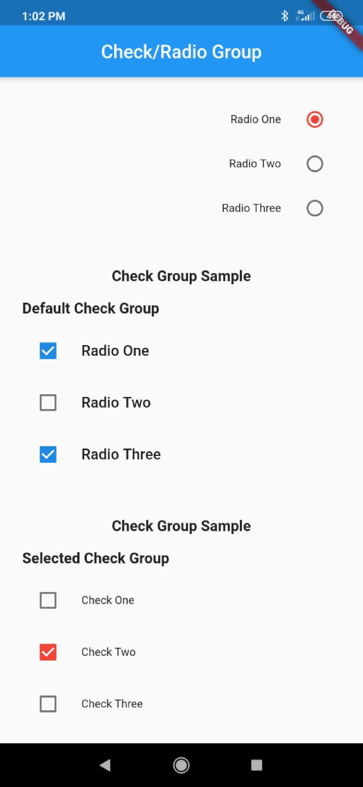

# Check/Radio Group


[](https://pub.dev/packages/check_radio_group)

## Usage
```dart
import 'package:check_radio_group/check/check_group.dart';
import 'package:check_radio_group/model/group_style.dart';
import 'package:check_radio_group/model/item_group.dart';
import 'package:check_radio_group/radio/radio_group.dart';
import 'package:flutter/material.dart';

void main() => runApp(MaterialApp(
      title: 'Radio/Check Group',
      theme: ThemeData(
        primarySwatch: Colors.blue,
      ),
      home: SamplePage(),
    ));

class SamplePage extends StatefulWidget {
  @override
  _SamplePageState createState() => _SamplePageState();
}

class _SamplePageState extends State<SamplePage> {
  final List<GroupItem> radioItems = [
    GroupItem(title: 'Radio One'),
    GroupItem(title: 'Radio Two'),
    GroupItem(title: 'Radio Three'),
  ];
  final List<GroupItem> checkItems = [
    GroupItem(title: 'Check One'),
    GroupItem(title: 'Check Two'),
    GroupItem(title: 'Check Three'),
  ];

  GroupItem _selected;

  @override
  void initState() {
    setState(() {
      _selected = radioItems[0];
    });
    super.initState();
  }

  @override
  Widget build(BuildContext context) {
    _titleWidget(String title) => Padding(
          padding: const EdgeInsets.all(8.0),
          child: Text(
            title,
            style: TextStyle(fontWeight: FontWeight.bold, fontSize: 16),
          ),
        );

    return Scaffold(
      appBar: AppBar(
        title: Text('Check/Radio Group'),
        centerTitle: true,
      ),
      body: Container(
        margin: EdgeInsets.all(16),
        child: ListView(
          children: <Widget>[
            Center(
              child: _titleWidget('Radio Group Sample'),
            ),
            _titleWidget('Default Radio Group'),
            RadioGroup(
              items: radioItems,
              onSelected: (item) {
                print(item.title);
              },
            ),
            SizedBox(
              height: 32,
            ),
            _titleWidget('Selected Radio Group'),
            RadioGroup(
              items: radioItems,
              selected: _selected,
              onSelected: (item) {
                print(item.title);
              },
            ),
            SizedBox(
              height: 32,
            ),
            _titleWidget('Custom Radio Group Style'),
            RadioGroup(
              items: radioItems,
              selected: _selected,
              style: GroupStyle(
                  activeColor: Colors.red,
                  checkPosition: ListTileControlAffinity.trailing,
                  titleAlign: TextAlign.end,
                  titleStyle: TextStyle(fontSize: 12)),
              onSelected: (item) {
                print(item.title);
              },
            ),
            SizedBox(
              height: 32,
            ),
            Center(
              child: _titleWidget('Check Group Sample'),
            ),
            _titleWidget('Default Check Group'),
            CheckGroup(
              items: radioItems,
              onSelected: (item) {
                print(item.title);
              },
            ),
            SizedBox(
              height: 32,
            ),
            Center(
              child: _titleWidget('Check Group Sample'),
            ),
            _titleWidget('Selected Check Group'),
            CheckGroup(
              items: checkItems,
              style: GroupStyle(
                  activeColor: Colors.red,
                  checkPosition: ListTileControlAffinity.leading,
                  titleAlign: TextAlign.left,
                  titleStyle: TextStyle(fontSize: 12)),
              onSelected: (item) {
                print(item.title);
              },
            ),
          ],
        ),
      ),
    );
  }
}


```


## Demo


